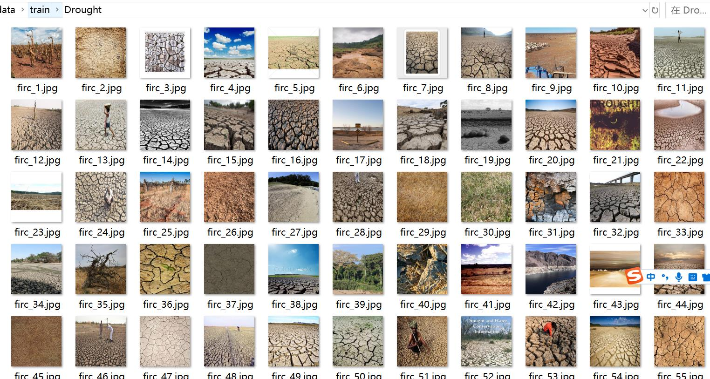
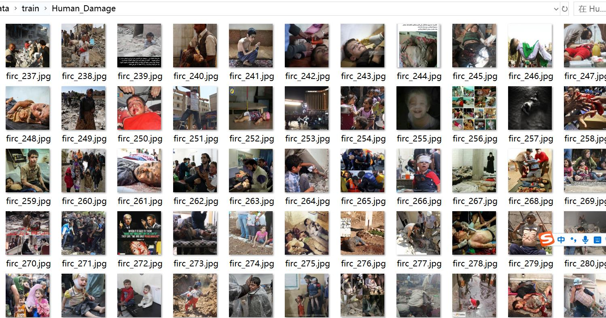
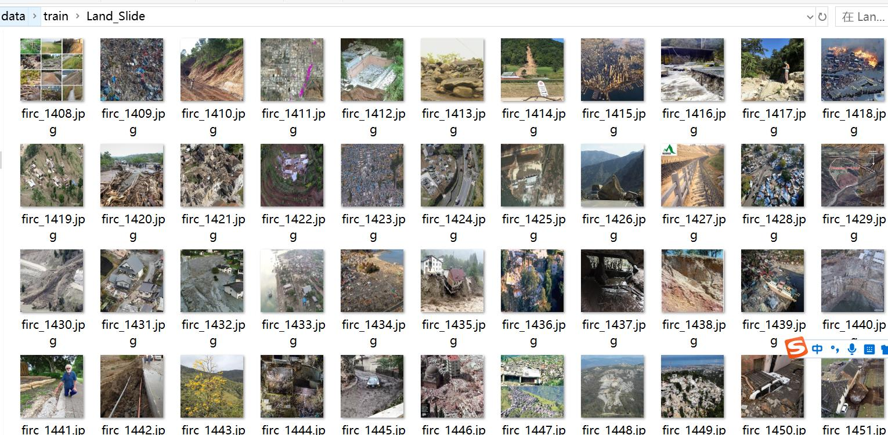
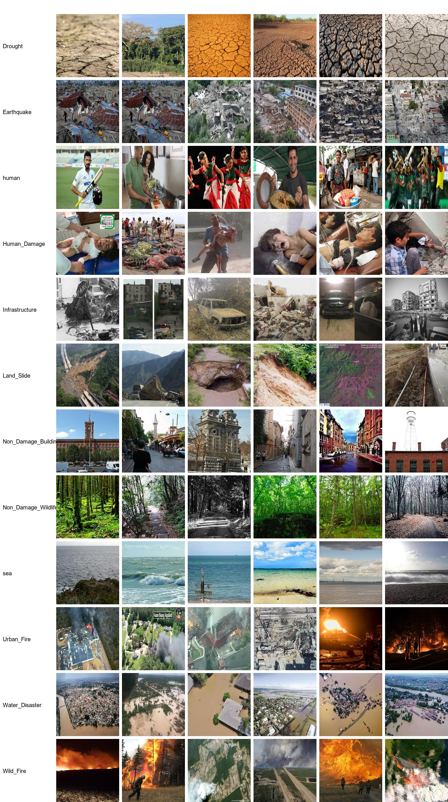

# Natural Disaster Image Classification Dataset with 13,376 Images in 12 Categories

Dataset type: Image classification for use in unlabeled data. Not suitable for target detection without labeled files.
Dataset format: Simply contains jpg images, each category folder contains the corresponding image.
Number of jpg files (total): 13376
Number of categories: 12
Category names: ['Drought', 'Earthquake', 'Human_Damage', 'Infrastructure', 'Land_Slide', 'Non_Damage_Buildings_Street', 'Non_Damage_Wildlife_Forest', 'Urban_Fire', 'Water_Disaster', 'Wild_Fire', 'human', 'sea']
Number of images per category:
Training set image count: 9362
Training set image count: 9402
- Drought training set image count: 131
- Earthquake training set image count: 25
- Human training set image count: 80
- Human_Damage training set image count: 160
- Infrastructure training set image count: 1011
- Land_Slide training set image count: 265
- Non_Damage_Buildings_Street training set image count: 3205
- Non_Damage_Wildlife_Forest training set image count: 1586
- sea training set image count: 1575
- Urban_Fire training set image count: 287
- Water_Disaster training set image count: 719
- Wild_Fire training set image count: 318
Validation set image count: 2674
- Drought validation set image count: 49
- Earthquake validation set image count: 9
- human validation set image count: 23
- Human_Damage validation set image count: 53
- Infrastructure validation set image count: 271
- Land_Slide validation set image count: 99
- Non_Damage_Buildings_Street validation set image count: 878
- Non_Damage_Wildlife_Forest validation set image count: 439
- sea validation set image count: 476
- Urban_Fire validation set image count: 71
- Water_Disaster validation set image count: 209
- Wild_Fire validation set image count: 97
Test set image count: 1340  
- Drought Test set image count: 11  
- Earthquake Test set image count: 2  
- human Test set image count: 17  
- Human_Damage Test set image count: 27  
- Infrastructure Test set image count: 133  
- Land_Slide Test set image count: 34  
- Non_Damage_Buidings_Street Test set image count: 484  
- Non_Damage_Wildlife_Forest Test set image count: 244  
- sea Test set image count: 222  
- Urban_Fire Test set image count: 36  
- Water_Disaster Test set image count: 86
- Wild_Fire Test set image count: 44
Total images:  
- Drought: Total images: 191
- Earthquake: Total images: 36
- Human: Total images: 120
- Human_Damage: Total images: 240
- Infrastructure: Total images: 1415
- Land_Slide: Total images: 398
- Non_Damage_Buildings_Street: Total images: 4567
- Non_Damage_Wildlife_Forest: Total images: 2269
- sea: Total images: 2273
- Urban_Fire: Total images: 394
- Water_Disaster: Total images: 1014
- Wild_Fire: Total images: 459
Important note: No data available yet.
Special Notice: This dataset does not guarantee the accuracy of any trained models or weight files.
Image Preview:
## Images

Here is a pay link on Stripe ( https://buy.stripe.com/3cs8yP7sY87d0vu9AB ). Please contact me lonlonago@foxmail.com after funding $89, and I will send you a complete data files , thank you!

